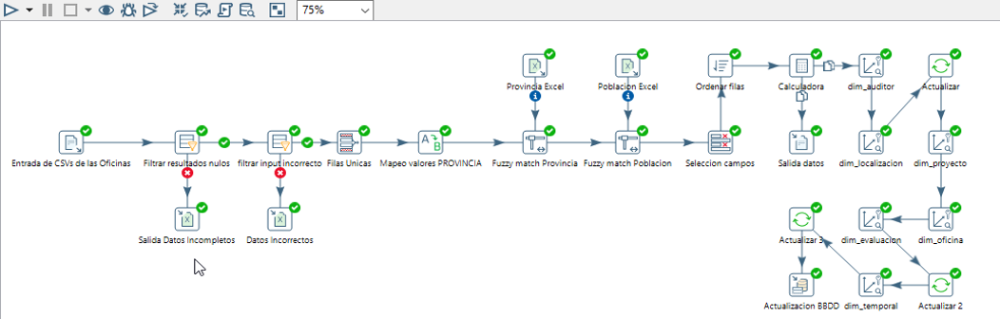

# pentaho_ETL
An end to end ETL project with Pentaho and MySQL with Data Warehouse design included.

This project presents a case scenario where a mystery shopping company anti-fraud department needs an easy way to follow up and analyze the different polls their employees are conducting. Every data record is being registered by each one of the offices.

* Data Warehouse design: MySQL dimensional star Schema

* ETL technologies:Pentaho and the Pentaho BI suit

### Data Warehouse Design

Tabla Hechos = Fact Table

### ETL Process (Pentaho)

#### Pentaho Jobs

### Pentaho ETL

